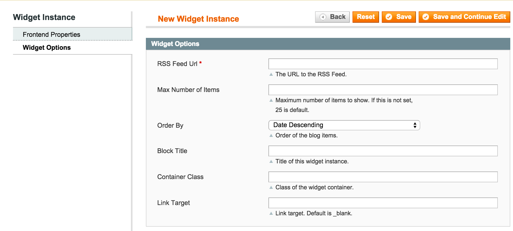

Blog Widget
==========
Show a list of blog articles in a widget.

Description
-----------
Magento widget to show a list of blog articles. You can order the articles by date 
or alphabetically by title. The widget can be placed in the left or right columns,
in the footer, etc. 


How to use
----------

Upload the extension files to your server. In the admin, under CMS -> Widgets,
add a new widget instance. Configure the widget options:



Example layout example e.g. local.xml:

```xml
<!-- Add blog feed extension. -->
<block type="aydus_blogwidget/widget" name="blogFeed">
	<action method="setContainerClass"><value>blogs-container</value></action>
	<action method="setData"><name>blog_url</name><value>http://fivethirtyeight.com/sports/feed/</value></action>
	<action method="setData"><name>max_items</name><value>3</value></action>
	<action method="setData"><name>order_by</name><value>pubDate</value></action>
</block>
```
